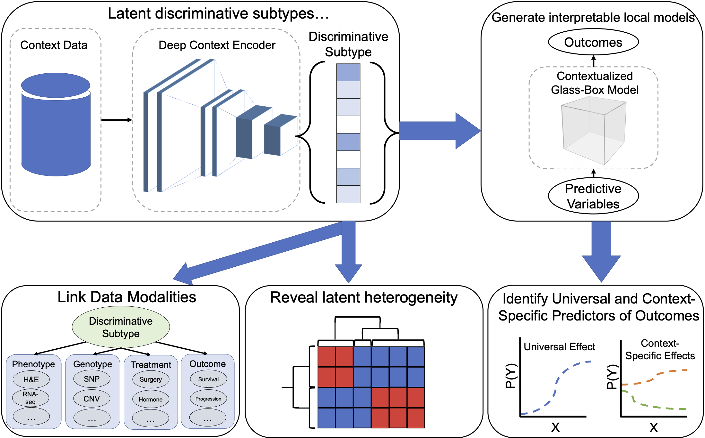

# Discriminative Subtyping
Code for [Discriminative Subtyping of Lung Cancers from Histopathology Images via Contextual Deep Learning](https://www.medrxiv.org/content/10.1101/2020.06.25.20140053v2).

We propose to use discriminative subtypes: latent representations of samples which provide optimality crtierion via downstream predictive performance. Because discriminative subtypes are defined by a machine learning criterion of downstream performance, these latent representations can be optimized via end-to-end training and then used in diverse downstream tasks.

This repository contains code for running Contextualized Explanation Networks (CEN) on TCGA/TCIA. 
Generic CEN code is available at https://github.com/alshedivat/cen.

Available models include:
- [CEN](https://github.com/blengerich/discriminative-subtyping/blob/main/cen/models/cen.py)
- [Multi-modal Mixture of Experts](https://github.com/blengerich/discriminative-subtyping/blob/main/cen/models/moe.py)
- [Inception](https://github.com/blengerich/discriminative-subtyping/blob/main/cen/networks/inceptionv3.py)

To facilitate experiments, [training](https://github.com/blengerich/discriminative-subtyping/blob/main/cen/experiment/train.py) and [eval](https://github.com/blengerich/discriminative-subtyping/blob/main/cen/experiment/eval.py) scripts are included.

Data handlers are provided for [TCGA](https://github.com/blengerich/discriminative-subtyping/blob/main/cen/data/tcga_v2.py) and [several other datasets](https://github.com/blengerich/discriminative-subtyping/tree/main/cen/data).
